<div align="center">
  
  
  # EFA - Environment for Agents
  
  **A comprehensive AI agent ecosystem with multi-provider LLM support and MCP protocol integration**
  
  [](https://www.python.org/downloads/)
  [](https://opensource.org/licenses/MIT)
  [](https://modelcontextprotocol.io/)
  [](https://groq.com/)
  
  [Quick Start](#-quick-start) • [Documentation](#-documentation) • [Examples](#-examples) • [API Reference](#-api-reference)
  
</div>

---

## 🎯 Overview

**EFA (Environment for Agents)** transforms AI from simple chatbots into capable, tool-wielding agents that can understand, plan, execute, and collaborate in complex real-world scenarios. Built on the Model Context Protocol (MCP), EFA provides a standardized, extensible platform for AI agents to interact with tools, APIs, and services.

### ✨ Key Features

- 🧠 **Multi-Provider LLM Support** - OpenRouter and Groq integration with seamless switching
- ⚡ **Ultra-Fast Inference** - Groq's specialized hardware for lightning-fast responses  
- 🛠️ **Rich Tool Ecosystem** - File operations, GitHub integration, code execution, and more
- 🔌 **MCP Protocol** - Standardized tool communication with SSE and JSON support
- 🤝 **Human-AI Collaboration** - Designed for seamless cooperative workflows
- 🛡️ **Sandboxed Execution** - Safe, isolated environments for code execution
- 📡 **Real-Time Communication** - Server-Sent Events for live updates and streaming

## 🚀 Quick Start

### Prerequisites

- Python 3.11+
- Git
- API keys for your chosen LLM provider

### Installation

```bash
# Clone the repository
git clone <your-repo-url>
cd EFA

# Create virtual environment
python -m venv .venv
source .venv/bin/activate  # Windows: .venv\Scripts\activate

# Install dependencies
pip install -r requirements.txt

# Set up environment variables
export GROQ_API_KEY="your_groq_api_key"        # For Groq
export OPENROUTER_API_KEY="your_openrouter_key" # For OpenRouter
```

### Launch EFA

```bash
# Start all services
cd github_environment
python main.py
```

This launches:
- **Backend API** (8000) - Core GitHub integration
- **Agent API** (8001) - AI agent tools  
- **MCP Server** (8002) - Protocol handler

### Start Chatting with Agents

```bash
# Launch the MCP LLM client
cd llm_services
python mcp_llm_client.py
```

Choose your provider and start collaborating with AI agents!

## 🏗️ Architecture

```mermaid
graph TB
    subgraph "🧠 Agent Brain"
        LLM[Multi-LLM Support]
        Router[Model Router]
        Conv[Conversation Manager]
    end
    
    subgraph "🔧 MCP Protocol Layer"
        Discovery[Tool Discovery]
        SSE[SSE/JSON Handler]
        Session[Session Manager]
    end
    
    subgraph "🛠️ Agent Tools"
        FS[File Operations]
        GH[GitHub Integration]
        Exec[Code Execution]
        Sand[Sandbox Manager]
    end
    
    subgraph "🌐 API Gateway"
        Backend[Backend API:8000]
        Agent[Agent API:8001]
        MCP[MCP Server:8002]
    end
    
    LLM --> Router
    Router --> Conv
    Conv --> Discovery
    Discovery --> SSE
    SSE --> Session
    Session --> FS
    Session --> GH
    Session --> Exec
    Exec --> Sand
    FS --> Backend
    GH --> Agent
    Sand --> MCP
```



## 📖 Documentation

### Core Components

| Component | Description | Port |
|-----------|-------------|------|
| **Backend API** | GitHub issue solving, session management | 8000 |
| **Agent API** | AI agent tools and file operations | 8001 |  
| **MCP Server** | Model Context Protocol handler | 8002 |
| **LLM Client** | Multi-provider LLM integration | - |

### Supported Providers

#### 🚀 Groq (Ultra-Fast)
- `llama-3.1-8b-instant` - Lightning fast responses
- `llama-3.1-70b-versatile` - High capability model
- `llama-3.3-70b-versatile` - Latest and greatest
- `mixtral-8x7b-32768` - Reasoning specialist

#### 🌍 OpenRouter (Multi-Provider)
- Access to 100+ models from various providers
- Free tier available with `hermes-3-llama-3.1-405b:free`
- Advanced models from Anthropic, OpenAI, Google, and more

## 💡 Examples

### Basic Agent Interaction

```python
from llm_services.mcp_llm_client import MCPLLMAgent
import asyncio

async def main():
    # Initialize with Groq for speed
    agent = MCPLLMAgent(provider="groq", model="llama-3.1-8b-instant")
    
    # Connect to MCP tools
    await agent.connect_to_servers(["ai_agent_tools"])
    
    # Start collaborating
    response = await agent.chat("List files in the current directory")
    print(response)
    
    # Clean up
    await agent.close()

asyncio.run(main())
```

### GitHub Issue Solving

```python
# Create a session for GitHub issue
session_data = {
    "github_issue_url": "https://github.com/user/repo/issues/123"
}

# The agent will:
# 1. Clone the repository
# 2. Analyze the issue
# 3. Explore the codebase
# 4. Generate solutions
# 5. Execute and test fixes
```

### Direct Groq Usage

```python
from llm_services.groq_llm_client import GroqClient

async with GroqClient() as client:
    response = await client.simple_chat(
        "Explain quantum computing",
        model="llama-3.1-70b-versatile"
    )
    print(response)
```

## 🔧 API Reference

### REST Endpoints

#### Backend API (Port 8000)
```http
POST /sessions                    # Create GitHub issue session
GET  /sessions/{id}              # Get session info  
POST /sessions/{id}/execute      # Execute code
GET  /docs                       # API documentation
```

#### Agent API (Port 8001)
```http
GET  /sessions/{id}/agent/ls     # List directory
POST /sessions/{id}/agent/cat    # Read file
POST /sessions/{id}/agent/write  # Write file
POST /sessions/{id}/agent/exec   # Execute command
```

#### MCP Protocol (Port 8002)
```http
POST /mcp                        # MCP protocol endpoint
# Supports: initialize, tools/list, tools/call, notifications/*
```

### Environment Variables

| Variable | Description | Required |
|----------|-------------|----------|
| `GROQ_API_KEY` | Groq API authentication | For Groq |
| `OPENROUTER_API_KEY` | OpenRouter API key | For OpenRouter |
| `PORT_BACKEND` | Backend server port | No (8000) |
| `PORT_AI_AGENT` | Agent server port | No (8001) |

## 🛠️ Development

### Adding Custom Tools

```python
# In ai_agent_mcp_tools.py
@mcp.tool(description="Your custom tool description")
async def your_custom_tool(param1: str, param2: int) -> Dict[str, Any]:
    """
    Implement your tool logic here
    """
    return {"result": "success", "data": "your_result"}
```

### Running Tests

```bash
# Test Groq integration
python -c "
from llm_services.groq_llm_client import GroqClient
import asyncio

async def test():
    async with GroqClient() as client:
        print(await client.simple_chat('Hello!'))

asyncio.run(test())
"

# Test MCP tools
python llm_services/mcp_llm_client.py
```

## 📋 Troubleshooting

<details>
<summary><strong>🔧 Common Issues</strong></summary>

**MCP Server Connection Failed**
```bash
curl http://localhost:8000/docs  # Check backend
curl http://localhost:8001/docs  # Check agent API
curl http://localhost:8002/mcp   # Check MCP endpoint
```

**API Key Issues**
```bash
echo $GROQ_API_KEY      # Verify Groq key
echo $OPENROUTER_API_KEY # Verify OpenRouter key
```

**Port Conflicts**
```bash
netstat -tlnp | grep -E "(8000|8001|8002)"
sudo fuser -k 8000/tcp  # Kill conflicting process
```

</details>

## 🤝 Contributing

We welcome contributions! Please see our [Contributing Guide](CONTRIBUTING.md) for details.

1. Fork the repository
2. Create a feature branch (`git checkout -b feature/amazing-feature`)
3. Commit your changes (`git commit -m 'Add amazing feature'`)
4. Push to the branch (`git push origin feature/amazing-feature`)
5. Open a Pull Request

## 📄 License

This project is licensed under the MIT License - see the [LICENSE](LICENSE) file for details.

## 🙋‍♂️ Support

- 📖 **Documentation**: Check the `/docs` endpoints for detailed API documentation
- 🐛 **Issues**: [Create a GitHub issue](../../issues) for bugs or feature requests
- 💬 **Discussions**: [Join our discussions](../../discussions) for questions and ideas
- 📧 **Contact**: [Your contact information]

## 🌟 Acknowledgments

- [Model Context Protocol](https://modelcontextprotocol.io/) - For the standardized tool communication
- [Groq](https://groq.com/) - For ultra-fast LLM inference
- [OpenRouter](https://openrouter.ai/) - For multi-provider LLM access
- The open-source AI community for inspiration and collaboration

---

<div align="center">
  <strong>Built with ❤️ for the AI agent revolution</strong>
  
  [⭐ Star this repo](../../stargazers) • [🍴 Fork it](../../fork) • [📖 Read the docs](#-documentation)
</div>